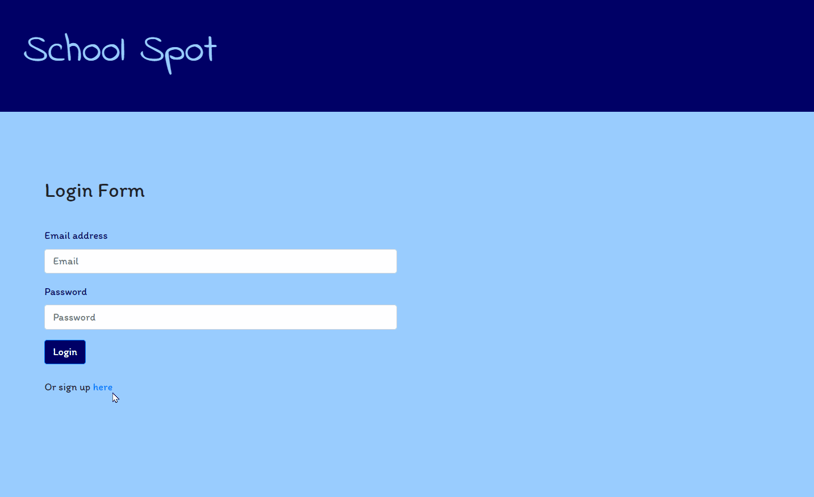
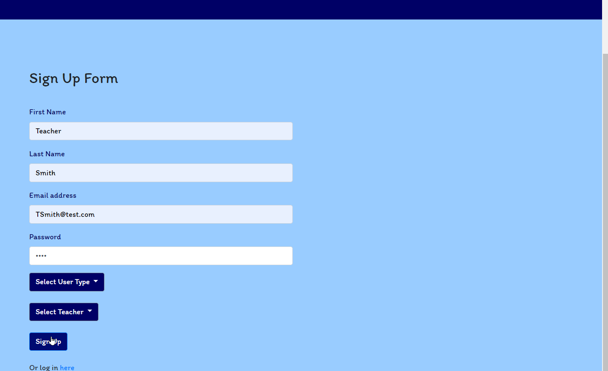
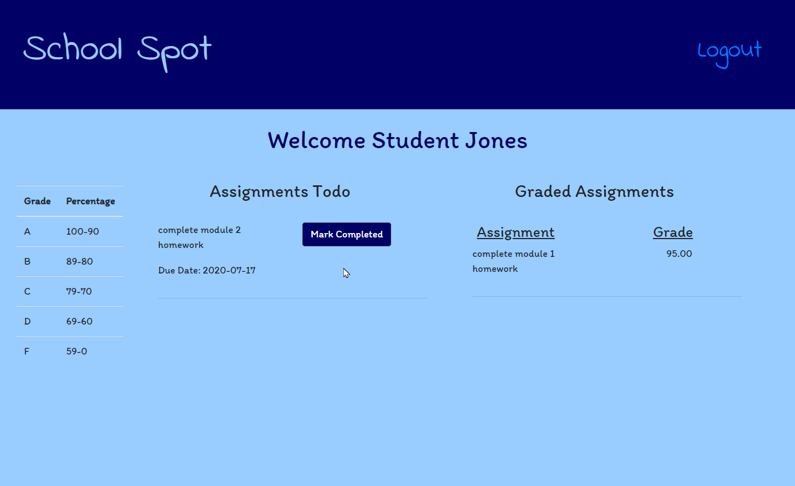

# School Spot


## Description
This application allows teachers and students to manage the student's assignments and grades. The teacher and student dashboards help to facilitate better communication and efficient grading of assignments.

## Deployment

[School Spot](https://fast-beach-51043.herokuapp.com/)



## Table of Contents

* [Installation](#installation)
* [Technology Used](#technology-used)
* [Usage](#usage)
* [Screenshots](#screenshots)
* [Questions](#questions)
* [Badges](#badges)
* [Authors](#author)
* [Contributing](#contributing)

## Installation
To install the node dependencies, please run the following command in terminal:
  
```
npm i
```

After the installation of all dependencies in above command, please run the following command in terminal to create the database:

```
npx sequelize-cli db:create
```

To initialize the server, run the following command:

```
node server.js
```

## Technology Used
<details>
    <summary markdown="span">Click to expand Project Technology Details</summary>

Languages
- HTML
- CSS
- Javascript
- SQL

Libraries
- [jQuery](jquery.com)
- [Node.js](nodejs.org)

npm Packages
- [@handlebars/allow-prototype-access](https://www.npmjs.com/package/@handlebars/allow-prototype-access)
- [bcrypt](https://www.npmjs.com/package/bcrypt)
- [eslint](https://www.npmjs.com/package/eslint)
- [express](https://www.npmjs.com/package/express)
- [express-handlebars](https://www.npmjs.com/package/express-handlebars)
- [express-session](https://www.npmjs.com/package/express-session)
- [handlebars](https://www.npmjs.com/package/handlebars)
- [mysql2](https://www.npmjs.com/package/mysql2)
- [nodemon](https://www.npmjs.com/package/nodemon)
- [passport](https://www.npmjs.com/package/passport)
- [passport-local](https://www.npmjs.com/package/passport-local)
- [sequelize](https://www.npmjs.com/package/sequelize)

CSS Framework
- [Bootstrap](getbootstrap.com)

</details>

## Usage
These instructions provide a start-to-finish guide for using this product. The instructions will be presented from both the instructor and the students perspective. All users must create a login from the signup page. The new user will then be returned to the login page to enter the web application. 

**Important** The student's instructor needs to be in the application prior to entering the student's data to make the instructor available for selection during setup.

### Instructor Guide:
Instructors will need to create a user account by navigating to the signup page by clicking on the "signup here" button at the bottom of the login page. The new user will then complete the form with first name, last name, email address, and a password. Then click on the "Submit" button to save the new user to the database and redirect the new user back to the login page. After login, the instructor is directed to the instructor's dashboard which provides the instructor with an overview of assignments that have been completed by the students are are ready to be graded, the assignments that have been graded but not recorded for end of term, and an area to assign new tasks to each of the instructor's students. There is also a handy grade rubric on the page for easy reference.

Once the instructor has reviewed the student's assignment, they can submit the grade for that assignment within the text box and click enter grade to record the grade within the database. This will move the assignment from the "Ready To Be Graded" column to the "Graded Assignments" column. At the end of the term, the instructor can record the grades that were assigned in their external grading system and then remove that assignment from the graded column by clicking on the delete button. This will provide the instructor with a "clean" dashboard for the new term.

### Student Guide:
Students will also need to create a user account by navigating to the signup page by clicking on the "signup here" button at the bottom of the login page. The new user will then complete the form with first name, last name, email address, a password, and select their instructor before clicking on the "Submit" button to save the new user to the database. The new student will then be redirected back to the login page. After login, the student is directed to the student's dashboard where the student will find scheduled assignments and posted grades for the current term. 

Once the student has completed an assignment, the student needs to click on the "completed" button to send the assignment notification to the instructor for grading. Once the instructor has graded the assignment, the graded assignment will be visible to the student on their dashboard. When the instructor closes out the current term (by deleting the graded assignments), the student will once again have a "clean" dashboard for assignments and grading for the new term.

## Screenshots


*Home Page of Application*



*Completion of signup page for new user*


*Demo of the instructor dashboard*



*Demo of the student dashboard*

## Questions
If you have any questions about the repo, open an issue or contact any of the [authors](#authors) listed below.

## Badges


## Author

[Helen Darden](https://github.com/hdarden)

[Ashley DeYoung](https://github.com/ashleydeyoung)

[Heather Sorrells](https://github.com/Hlsorrells)

## Contributing
Go to GitHub repo and create a pull request or email the authors directly. See [Questions](#questions).
